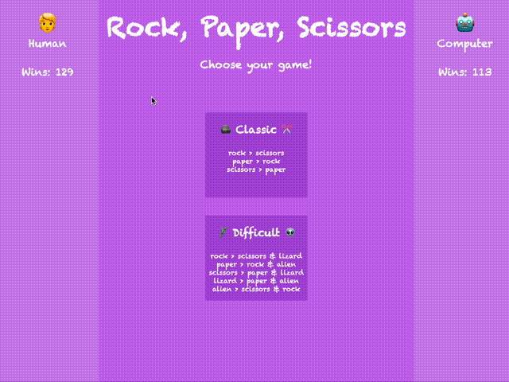

# rockPaperScissors

### Abstract:
[//]: <> (Briefly describe what you built and its features. What problem is the app solving? How does this application solve that problem?)
Have you ever wanted to play one of the first games you learned as a child against a bot on the intenet? Well look no further - play against my super advanced AI who is guaranteed to give you a run for your money almost exactly 33.3% of the time.
#### Features!
- Fast-paced roshambo action, with TWO challenging levels to choose from: classic and difficult!
- Once you have entered a game, select your fighter!
    - all clickable elements have a pointer to help guide your important choices
    - Your player icon will appear below your fighter upon clicking, confirming the choice is locked in!
    - The computer reveals their fighter at the same time, with the revealed winner incrementing their wins.
- At any point, you can click the "CHANGE GAME?" button in your player sidebar to return to the main page to select a different game option.
- Win counts persist across game types.
- If you refresh the page or close your browser, have no fear! Your record of domination will be preserved across sessions!

### Installation Instructions:
[//]: <> (What steps does a person have to take to get your app cloned down and running?)
1. fork this repository https://github.com/mbenfowler/rockPaperScissors
2. Clone down your new, forked repo using the generated SSH link in the terminal
3. cd into the repository
4. To view the code, open it in your text editor
5. View the app locally in the browser by running `open index.html` in your terminal

### Preview of App:

### Context:
[//]: <> (Give some context for the project here. How long did you have to work on it? How far into the Turing program are you?)
- This Turing solo project kicked-off on Tues 18, 2023 and we were provided a full week to complete it.
- This was the final solo project of Mod1

### Contributors:
[//]: <> (Who worked on this application? Link to their GitHubs.)
- [Matt Fowler](https://github.com/mbenfowler)

### Learning Goals:
[//]: <> (What were the learning goals of this project? What tech did you work with?)
In this project, HTML, CSS, and JavaScript were used.
Learning goals were to solidify and demonstrate understanding of:
- DRY JavaScript
- event delegation to handle similar event listeners
- Understand the difference between the data model and how the data is displayed on the DOM
- Use your problem solving process to break down large problems, solve things step by step, and trust yourself to not rely on an outside “answer” to a logical challenge

### Wins + Challenges:
[//]: <> (What are 2-3 wins you have from this project? What were some challenges you faced - and how did you get over them?)
#### Wins:
- first time implementing localStorage!
- getting comfortable with ternary and spread operators

#### Challenges:
- absolute positioning is always a challenge. I could not for the life of me figure out how to consistantly place the human emoji over the fighter they had chosen.
- i'm still shaky on preventDefault and stopPropagation. Personal to-do added to experiment more with those.